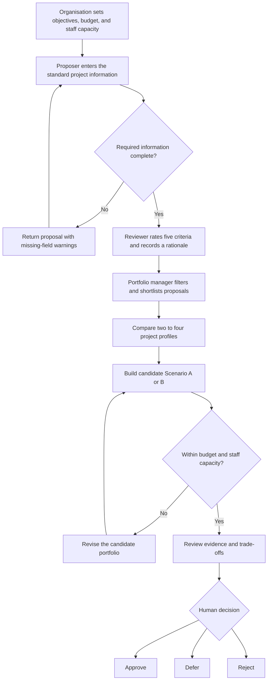

# Project review process — working draft

```mermaid
flowchart TD
    A[Organisation sets objectives, budget, and staff capacity]
    B[Proposer enters the standard project information]
    C{Required information complete?}
    D[Return proposal with missing-field warnings]
    E[Reviewer rates five criteria and records a rationale]
    F[Portfolio manager filters and shortlists proposals]
    G[Compare two to four project profiles]
    H[Build candidate Scenario A or B]
    I{Within budget and staff capacity?}
    J[Revise the candidate portfolio]
    K[Review evidence and trade-offs]
    L{Human decision}
    M[Approve]
    N[Defer]
    O[Reject]

    A --> B --> C
    C -- No --> D --> B
    C -- Yes --> E --> F --> G --> H --> I
    I -- No --> J --> H
    I -- Yes --> K --> L
    L --> M
    L --> N
    L --> O
```

The tool supports the discussion but does not calculate one overall score, automatically rank projects, or choose a portfolio.
